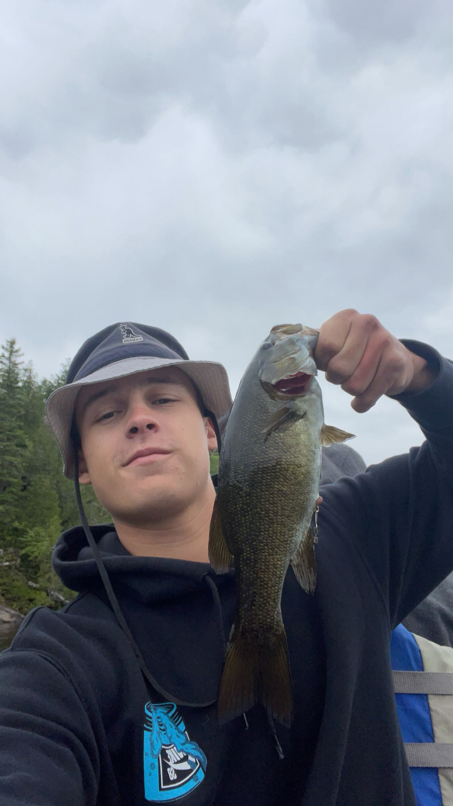

# MMED-1054 - Homework 1 Assignment

This repository is a readme file project for MMED-1054.

## Sihler Baldock - About Me

### Background

- I was born in 2003 in Englewood, Colorado.
- I moved to Simcoe, Ontario in 2005 and have lived there ever since.
- I lived in St. Cathrines for a year to attend Brock University.

### Hobbies

- Video games
- Fishing
- Hockey
- Basketball
- Watching anime